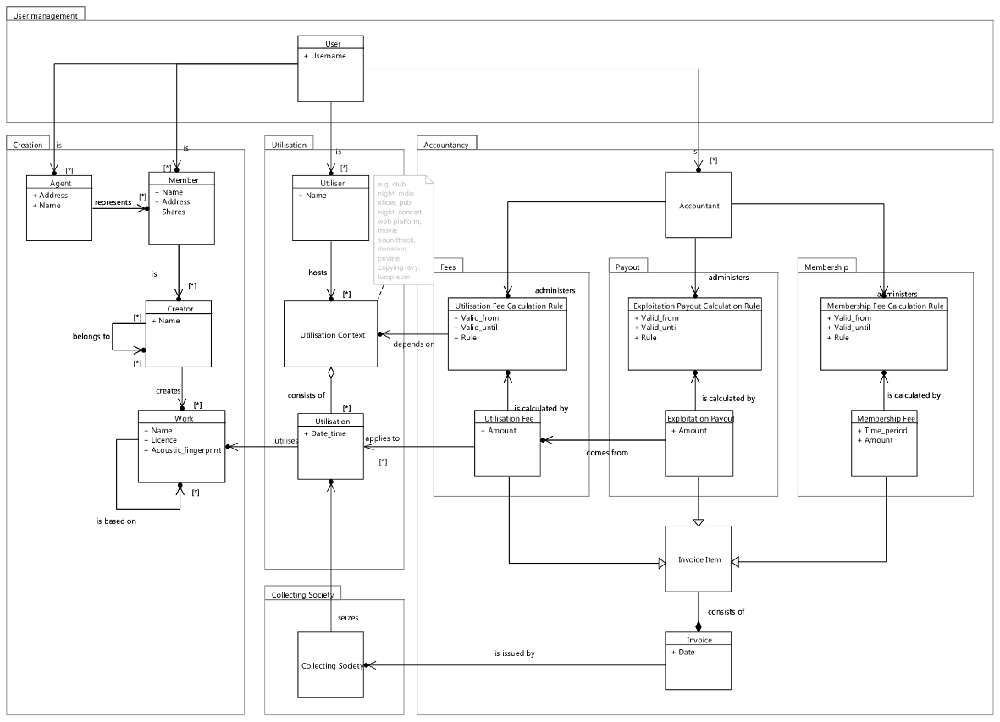
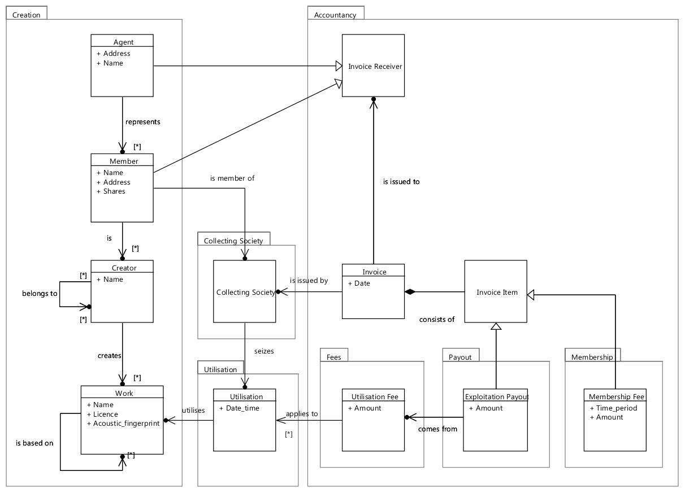
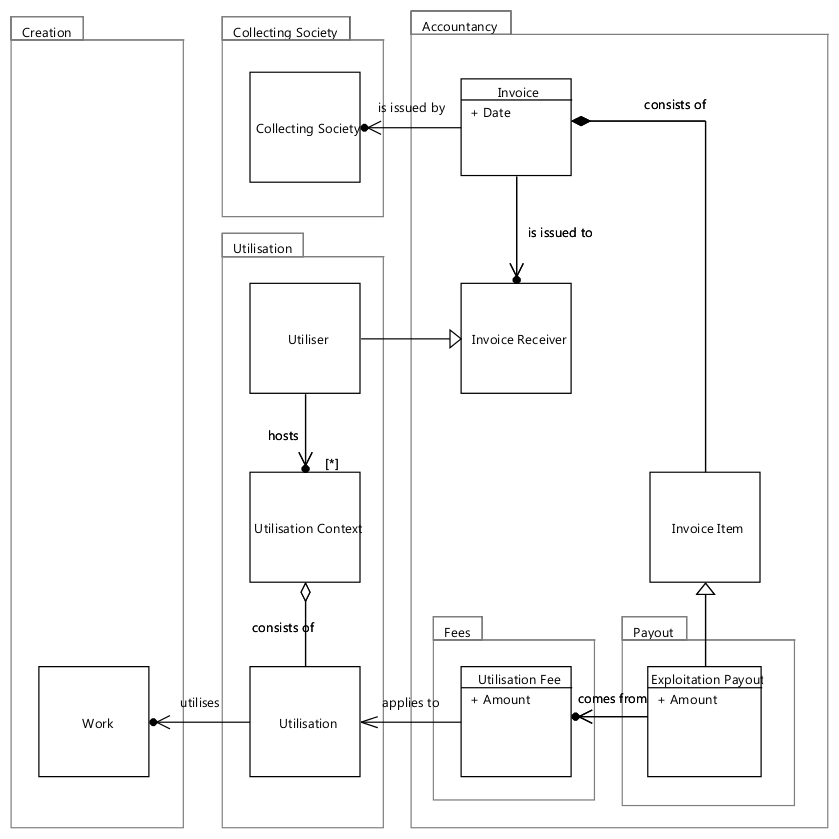

=====================
Logisches Datenmodel
=====================

Beim logischen Datenmodell handelt es sich um eine Beschreibung der
Entitäten und deren Relationen zueinander auf einer abstrakten Ebene,
die noch nichts mit einer zukünftigen Implementierung zu tun hat.

Das Modell ist in diesem Repository im Ordner **design/model**
zu finden. Darin ein Ordner mit dem Modell in der mit Papyrus verwendbaren
Version und ebenso als exportierte Grafiken.

Es wurde als UML-Modell in Eclipse mit dem quelloffenen Plugin Papyrus
(Teil der Modeling Tools) erstellt. Eine kurze Anleitung, wie
man Papyrus installieren kann, gibt es unter :ref:`papyrus`

Das Modell ist in drei Diagrammen dargestellt. Jedes
Diagramm bietet der Übersichtlichkeit halber nur eine Teilsicht auf das
Modell und alle Zusammenhänge ergeben sich erst aus den drei Diagrammen
zusammen.

Diagramm: user view
=======================

Das erste Diagramm ist "user view" benannt, weil es eine Sicht aus
dem Blickwinkel eines Benutzers zeigt. Im Folgenden wird das
Diagramm von links nach rechts und innerhalb der Spalten von oben nach
unten erläutert.

Als Benutzer des Systems kann man mehrere Rollen einnehmen. Man kann
Mitglied (Member), Agentur/Manager (Agent) mehrerer Mitglieder, Nutzer
(Utiliser) oder Buchhalter (Accountant) sein.

Ein Agent repräsentiert Mitglieder und kann Belange in deren Namen
regeln. Das Mitglied selbst kann eine beliebige Anzahl von Erschaffern
(Künstler/Pseudonym/Projekt) sein. Solch ein Erschaffer kann wiederum
Teil eines anderen Erschaffers sein (Solokünstler, die auch Teil einer
Band sind; Kooperationen zwischen Künstlern, etc.). Solche ein
Erschaffer schafft ein Werk, das auf anderen Werken basieren kann.

Der Nutzer von Werken veranstaltet ein Nutzungsumfeld (Utilisation
Context). Ein solches Umfeld ist bewusst abstrakt gehalten und kann
alles mögliche sein, bspw. Radiosendung, Konzert, Kneipenmusik oder
DJ-Set im Club, aber auch Einbettung in einen Film, Spenden,
Urheberrechtsabgaben auf Leermedien oder Pauschalabgaben. Solch ein
Nutzungsumfeld besteht aus einer Menge von Nutzungen (Utilisation) von
Werken.

Die Verwertungsgesellschaft ist in diesem Diagramm dafür Zuständig, die
Verwertungsrechte wahrzunehmen, also Nutzungen von Werken abzurechnen.
Dazu stellt sie Rechnungen aus. Die Verwertungsgesellschaft als solche
muss nicht unbedingt die C3S sein. Das Datenmodell könnte ebenfalls die
GEMA als Verwertungsgesellschaft und deren Abrechnungen darstellen. Das
kann hilfreich sein, falls es im Zusammenhang mit der GEMA-Vermutung
bzw. einer möglicherweise zukünftig allgemeinen
Vewertungsgesellschaftsvermutung nötig wird, dass die
Verwertungsgesellschaften Abrechnungen füreinander vornehmen, damit sich
Nutzer an eine einzige Stelle werden können.

In der Buchhaltung gibt es einen Buchhalter, der in dem Modell nur als
Administrator der Berechnungsregeln zu verstehen ist. Berechnungen sind
derart abstrahiert, dass es vom Modell unabhängig ist, wie der jeweilige
Verteilungsschlüssel aussieht. Es gibt bisher drei Berechnungsregeln,
eine für die Kosten einer Nutzung, eine weitere für die sich daraus
ergebende Ausschüttung und eine dritte für Mitgliedbeiträge. Für
verschiedene Nutzungsumfelder und deren Parameter (Publikumsgröße,
Vertriebsweg, etc.) können verschiedene Berechnungsregeln existieren.
Auf Basis einer solchen Regel errechnet sich für die Nutzung eines Werks
in einem Nutzungsumfeld dann die Nutzungsgebühr. Aus der Nutzungsgebühr
wird wiederum über eine Regel die Ausschüttung berechnet. Die
Mitgliedsgebühr wird ebenfalls nach speziellen Regeln berechnet, bspw.
reduziert sie die Ausschüttung höchstens zur Hälfte. Alle drei Arten von
Posten stehen dann auf einer Rechnung, die von der
Verwertungsgesellschaft ausgestellt wird.

Diagramm: creator view
========================

Dieses Diagramm zeigt die Sicht des Werkschaffenden und ergänzt das
Diagramm "user view" um den Umstand, dass ein Mitglied einer
Verwertungsgesellschaft angehört und ebenso wie der Agent Empfänger von
Abrechnungen ist.

Diagramm: utiliser view
=========================

Ähnlich wie das Diagramm "creator view" wird hier nur der Zusammenhang
zwischen dem Nutzer und den Rechnungen ergänzt. Ansonsten ist die
Darstellung ein wenig anders, aber die Zusammenhänge sind die gleichen
wie in "user view".
